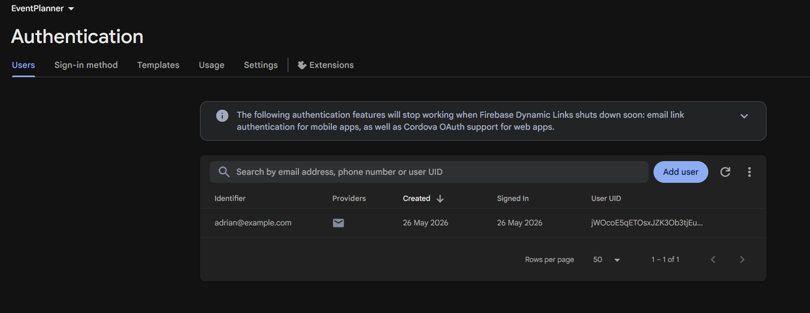
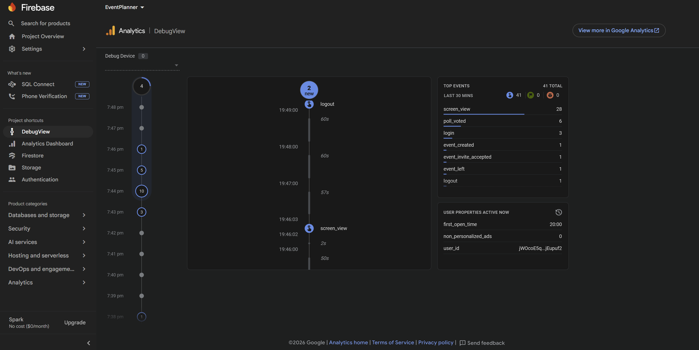
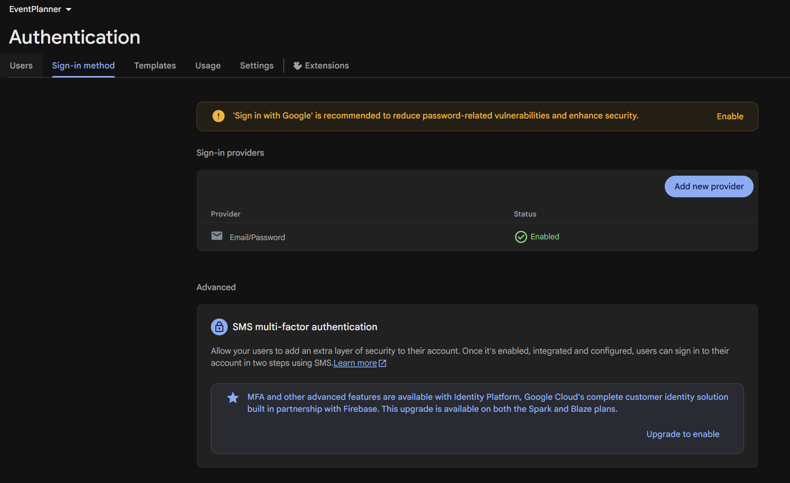
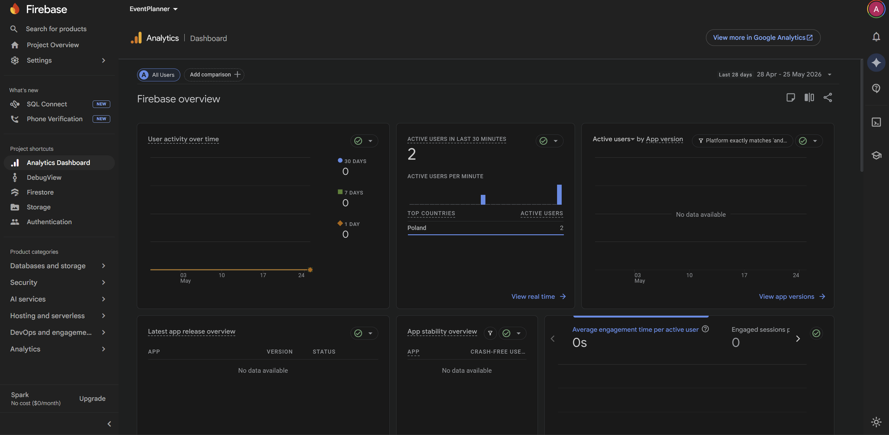
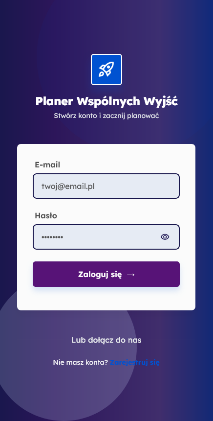
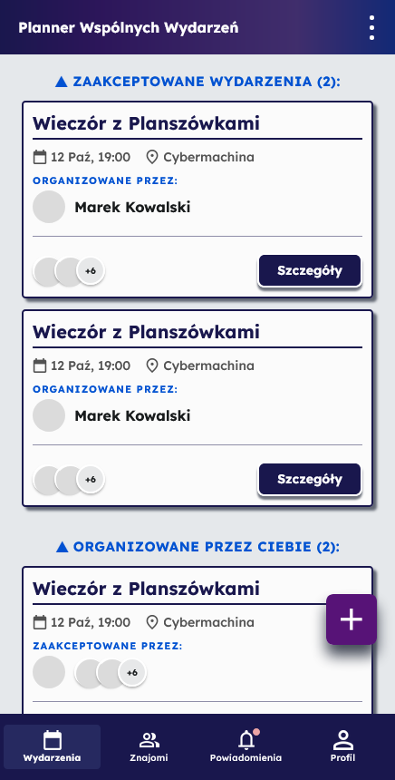
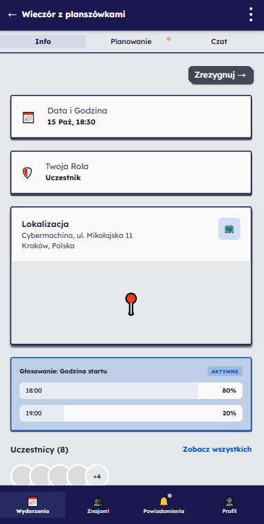
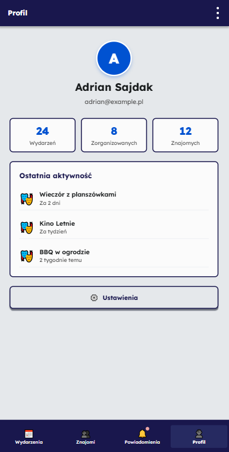

# EventPlanner

Aplikacja mobilna do organizowania wspólnych spotkań ze znajomymi.  
Projekt został wykonany w React Native z wykorzystaniem Firebase Authentication oraz Firebase Analytics.

---

# Funkcjonalności

- tworzenie wydarzeń,
- zarządzanie wydarzeniami,
- system zaproszeń,
- głosowania dotyczące miejsca i terminu,
- obsługa uczestników wydarzenia,
- powiadomienia w aplikacji,
- historia wydarzeń,
- logowanie użytkownika.

---

# Technologie

- React Native
- TypeScript
- React Navigation
- Firebase Authentication
- Firebase Analytics
- Context API
- StyleSheet

---

# Struktura projektu

```bash
src/
├── components/
│   └── common/
│       ├── BottomNavBar.tsx
│       ├── Button.tsx
│       ├── EventCard.tsx
│       ├── Input.tsx
│       └── Navbar.tsx
│
├── context/
│   ├── EventsContext.tsx
│   └── FriendsContext.tsx
│
├── data/
│   ├── mockEvents.ts
│   └── mockFriends.ts
│
├── navigation/
│   ├── AuthNavigator.tsx
│   ├── EventsNavigator.tsx
│   ├── FriendsNavigator.tsx
│   ├── MainNavigator.tsx
│   ├── ProfileNavigator.tsx
│   └── index.tsx
│
├── screens/
│   ├── auth/
│   ├── dashboard/
│   ├── events/
│   ├── friends/
│   ├── notifications/
│   └── profile/
```

---

# Architektura aplikacji

Projekt został podzielony na moduły zgodnie z dobrymi praktykami React Native.

## Components

Folder `components/common` zawiera reużywalne komponenty UI wykorzystywane w wielu ekranach aplikacji:

- `Button`,
- `Input`,
- `Navbar`,
- `BottomNavBar`,
- `EventCard`.

## Screens

Folder `screens` zawiera główne widoki aplikacji:

- autoryzacja,
- dashboard,
- wydarzenia,
- znajomi,
- powiadomienia,
- profil.

## Navigation

Folder `navigation` odpowiada za konfigurację nawigacji pomiędzy ekranami aplikacji.

W projekcie zastosowano osobne navigatory dla głównych sekcji:

- `AuthNavigator`,
- `MainNavigator`,
- `EventsNavigator`,
- `FriendsNavigator`,
- `ProfileNavigator`.

## Context API

Folder `context` zawiera logikę współdzielenia danych pomiędzy komponentami aplikacji:

- `EventsContext`,
- `FriendsContext`.

## Data

Folder `data` zawiera dane testowe wykorzystywane podczas developmentu aplikacji:

- `mockEvents`,
- `mockFriends`.

---

# Nawigacja aplikacji

Aplikacja wykorzystuje React Navigation.  
Widoki zostały podzielone na osobne sekcje nawigacyjne.

| Obszar | Opis |
|---|---|
| Auth | logowanie i rejestracja użytkownika |
| Dashboard | ekran główny z listą wydarzeń |
| Events | szczegóły wydarzeń i zarządzanie wydarzeniami |
| Friends | lista znajomych i grupy znajomych |
| Notifications | powiadomienia użytkownika |
| Profile | profil użytkownika i ustawienia |

---

# Logowanie użytkownika

Aplikacja wykorzystuje Firebase Authentication.

W projekcie zaimplementowano:

- logowanie użytkownika,
- obsługę konta przez Email/Password,
- wylogowanie użytkownika,
- przechowywanie stanu zalogowania,
- rozdzielenie widoków autoryzacji i widoków aplikacji.

## Firebase Authentication

### Konfiguracja metody logowania



### Lista użytkowników Firebase



---

# Firebase Analytics

Projekt zawiera integrację Firebase Analytics umożliwiającą monitorowanie aktywności użytkownika w aplikacji mobilnej.

Rejestrowane zdarzenia:

- `screen_view`,
- `login`,
- `logout`,
- `event_created`,
- `event_invite_accepted`,
- `event_left`,
- `poll_voted`.

## Firebase Analytics Dashboard



## Firebase DebugView



---

# Screeny aplikacji

## Logowanie



## Dashboard



## Widok wydarzenia



## Profil



---

# Uruchomienie projektu

## Instalacja zależności

```bash
npm install
```

## Uruchomienie projektu

```bash
npm start
```

## Uruchomienie wersji webowej

```bash
npm run web
```

---

# Autorzy i podział pracy

| Członek zespołu | Zakres odpowiedzialności |
|---|---|
| Justyna Pudełko | Projekt interfejsu użytkownika, przygotowanie widoków aplikacji, stylowanie komponentów oraz współtworzenie frontendu aplikacji |
| Gabriela Obrzud | Opracowanie dokumentacji projektowej, opisów funkcjonalnych oraz wsparcie przy implementacji interfejsu użytkownika oraz współtworzenie frontendu aplikacji |
| Adrian Sajdak | Implementacja frontendu aplikacji, konfiguracja nawigacji, logiki aplikacji oraz integracja głównych funkcjonalności systemu |

---

# Wspólna praca nad projektem

Wszyscy członkowie zespołu uczestniczyli w tworzeniu aplikacji frontendowej, implementacji komponentów React Native, testowaniu widoków oraz rozwijaniu funkcjonalności zgodnych z przygotowanym projektem UI/UX.
