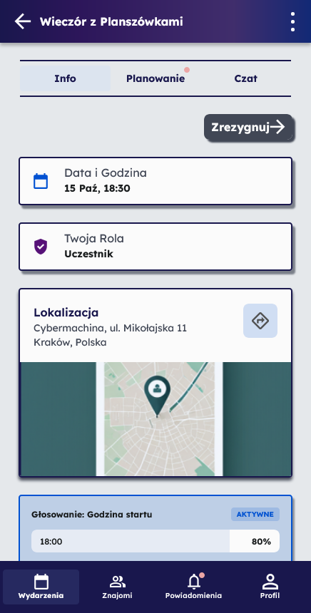
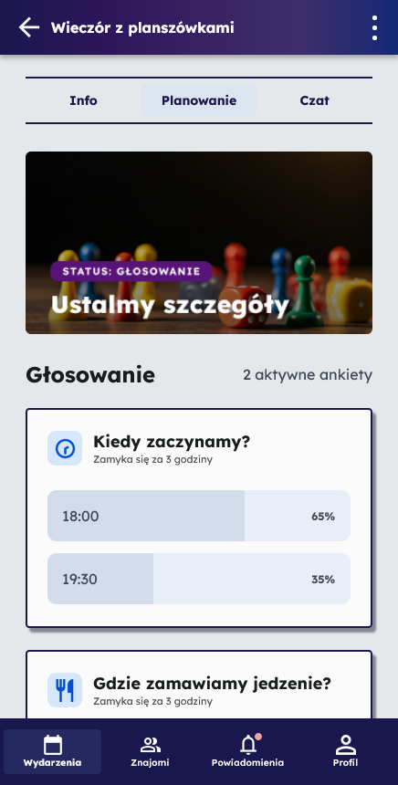
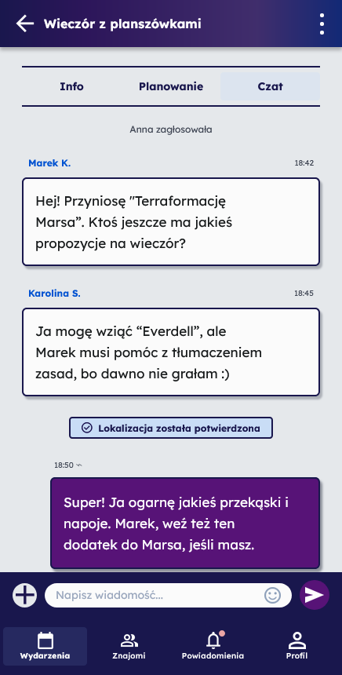
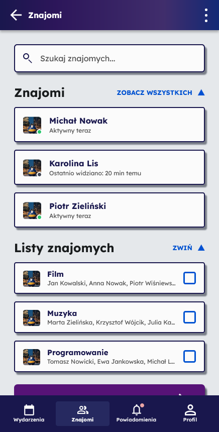
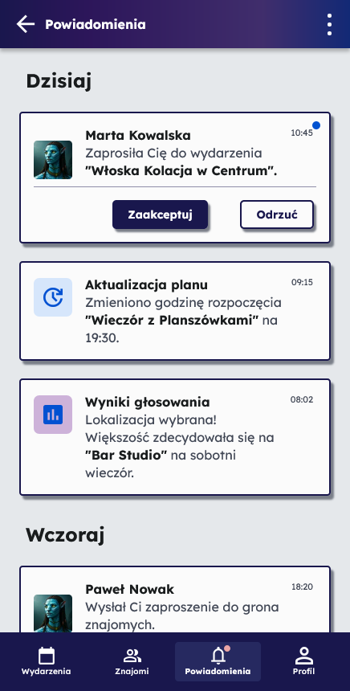
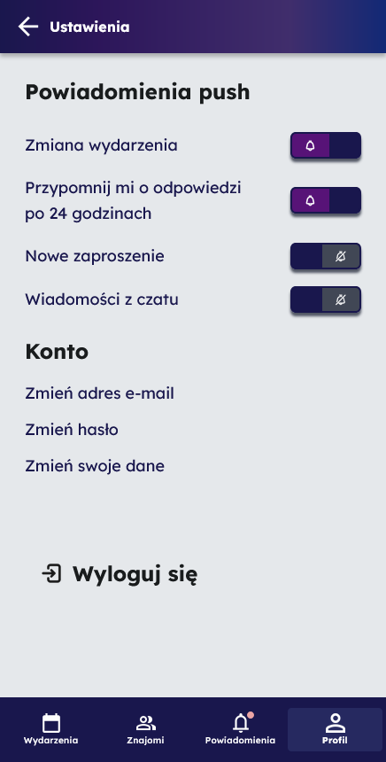

# EventPlanner

Aplikacja do planowania wspólnych wyjść ze znajomymi. Pozwala tworzyć wydarzenia, zapraszać uczestników, ustalać szczegóły spotkania przez ankiety oraz prowadzić rozmowę w czacie wydarzenia.

Projekt został wykonany w React Native i Expo z wykorzystaniem React Navigation, Firebase Authentication oraz Firebase Analytics.

---

# Funkcjonalności

- logowanie i rejestracja użytkownika,
- dashboard z wydarzeniami do akceptacji, zaakceptowanymi i organizowanymi przez użytkownika,
- tworzenie i edycja wydarzeń,
- odwoływanie wydarzenia lub rezygnacja z udziału,
- zapraszanie znajomych i list znajomych,
- szczegóły wydarzenia z datą, rolą, lokalizacją, mapą, ankietą i uczestnikami,
- planowanie wydarzenia przez głosowania i kontrpropozycje,
- czat wydarzenia z wiadomościami, ankietą i zdjęciami,
- ekran znajomych, list znajomych i sugerowanych kontaktów,
- powiadomienia o zaproszeniach, zmianach planu, wynikach głosowań i odwołanych wydarzeniach,
- profil użytkownika z informacjami, statystykami i historią,
- ustawienia konta, powiadomień push, danych osobowych, e-maila i hasła.

---

# Technologie

- Expo
- TypeScript
- React Native
- React Native Web
- React Navigation
- Firebase Authentication
- Firebase Analytics
- Expo Google Fonts
- Context API
- StyleSheet

---

# Struktura projektu

```bash
EventPlanner/
├── App.tsx
├── app.json
├── index.ts
├── package.json
├── tsconfig.json
├── google-services.json
│
├── assets/
│   ├── icons/
│   ├── images/
│   └── screens/
│
├── scripts/
│
└── src/
    ├── firebaseConfig.ts
    │
    ├── components/
    │   ├── common/
    │   │   ├── AppIcon.tsx
    │   │   ├── BottomNavBar.tsx
    │   │   ├── Button.tsx
    │   │   ├── EventCard.tsx
    │   │   ├── GradientSurface.tsx
    │   │   ├── Input.tsx
    │   │   └── Navbar.tsx
    │   ├── friends/
    │   │   └── FriendsUi.tsx
    │   └── profile/
    │       └── SettingsFormControls.tsx
    │
    ├── context/
    │   ├── EventsContext.tsx
    │   └── FriendsContext.tsx
    │
    ├── data/
    │   ├── mockEvents.ts
    │   └── mockFriends.ts
    │
    ├── navigation/
    │   ├── AuthNavigator.tsx
    │   ├── EventsNavigator.tsx
    │   ├── FriendsNavigator.tsx
    │   ├── MainNavigator.tsx
    │   ├── ProfileNavigator.tsx
    │   └── index.tsx
    │
    ├── screens/
    │   ├── auth/
    │   ├── dashboard/
    │   ├── events/
    │   ├── friends/
    │   ├── notifications/
    │   └── profile/
    │
    ├── services/
    │   ├── analytics.ts
    │   ├── analytics.web.ts
    │   └── auth.ts
    │
    └── theme/
        ├── colors.ts
        └── typography.ts
```

---

# Architektura aplikacji

Projekt został podzielony na moduły zgodnie z dobrymi praktykami React Native.

## Components

Folder `components` zawiera reużywalne elementy interfejsu:

- `components/common` - wspólne komponenty UI: `AppIcon`, `BottomNavBar`, `Button`, `EventCard`, `GradientSurface`, `Input`, `Navbar`,
- `components/friends` - elementy list znajomych i zapraszania,
- `components/profile` - kontrolki formularzy w ustawieniach profilu.

## Screens

Folder `screens` zawiera widoki aplikacji pogrupowane według głównych sekcji:

- `auth` - logowanie i rejestracja,
- `dashboard` - lista wydarzeń użytkownika,
- `events` - tworzenie, edycja, szczegóły, planowanie, czat i historia wydarzeń,
- `friends` - znajomi, listy znajomych i zapraszanie,
- `notifications` - powiadomienia,
- `profile` - profil, ustawienia i formularze zmiany danych.

## Navigation

Folder `navigation` odpowiada za konfigurację nawigacji pomiędzy ekranami aplikacji.

W projekcie zastosowano osobne navigatory dla głównych sekcji:

- `AuthNavigator`,
- `MainNavigator`,
- `EventsNavigator`,
- `FriendsNavigator`,
- `ProfileNavigator`.

Dolny pasek nawigacji prowadzi do dashboardu wydarzeń, znajomych, powiadomień oraz profilu użytkownika. Menu z trzema kropkami prowadzi do ustawień.

## Context API

Folder `context` zawiera logikę współdzielenia danych pomiędzy komponentami aplikacji:

- `EventsContext`,
- `FriendsContext`.

## Data

Folder `data` zawiera dane testowe wykorzystywane podczas developmentu aplikacji:

- `mockEvents`,
- `mockFriends`.

## Services

Folder `services` zawiera warstwę integracji z usługami zewnętrznymi:

- `auth` - obsługa logowania, rejestracji i wylogowania,
- `analytics` - zdarzenia Firebase Analytics dla aplikacji mobilnej,
- `analytics.web` - bezpieczne pomijanie natywnego Analytics podczas uruchamiania wersji webowej.

## Theme i assets

Folder `theme` zawiera współdzielone kolory i typografię. Folder `assets` przechowuje ikony SVG/PNG z projektu, obrazy używane w ekranach oraz screeny aplikacji wykorzystywane w README.

---

# Nawigacja aplikacji

Aplikacja wykorzystuje React Navigation.  
Widoki zostały podzielone na osobne sekcje nawigacyjne.

| Obszar | Opis |
|---|---|
| Auth | logowanie i rejestracja użytkownika |
| Dashboard | ekran główny z listą wydarzeń |
| Events | tworzenie, edycja, szczegóły, planowanie i czat wydarzenia |
| Friends | lista znajomych, listy znajomych i zapraszanie uczestników |
| Notifications | powiadomienia użytkownika |
| Profile | profil użytkownika, historia i ustawienia konta |

---

# Logowanie użytkownika

Aplikacja wykorzystuje Firebase Authentication.

W projekcie zaimplementowano:

- logowanie użytkownika,
- rejestrację konta,
- obsługę konta przez Email/Password,
- wylogowanie użytkownika,
- przechowywanie stanu zalogowania,
- rozdzielenie widoków autoryzacji i widoków aplikacji.

## Firebase Authentication

### Konfiguracja metody logowania


### Lista użytkowników Firebase


---

# Firebase Analytics

Projekt zawiera integrację Firebase Analytics umożliwiającą monitorowanie aktywności użytkownika w aplikacji mobilnej.

W wersji webowej używany jest osobny plik `analytics.web.ts`, dzięki któremu aplikacja może uruchamiać się w przeglądarce bez natywnego modułu Firebase Analytics.

Rejestrowane zdarzenia:

- `screen_view`,
- `login`,
- `logout`,
- `event_created`,
- `event_invite_accepted`,
- `event_left`,
- `poll_voted`.

## Firebase Analytics Dashboard


## Firebase DebugView


---

# Screeny aplikacji

## Logowanie


## Rejestracja


## Dashboard


## Nowe wydarzenie


## Widok wydarzenia


## Szczegóły wydarzenia



## Planowanie wydarzenia



## Czat wydarzenia



## Znajomi



## Powiadomienia



## Profil


## Ustawienia



---

# Uruchomienie projektu

## Instalacja zależności

```bash
npm install
```

## Uruchomienie projektu

```bash
npm start
```

## Uruchomienie wersji webowej

```bash
npm run web
```

Projekt nie zawiera skryptu `npm run dev`; do pracy w przeglądarce należy używać `npm run web`.

---

# Autorzy i podział pracy

| Członek zespołu | Zakres odpowiedzialności |
|---|---|
| Justyna Pudełko | Projekt interfejsu użytkownika, przygotowanie widoków aplikacji, stylowanie komponentów oraz współtworzenie frontendu aplikacji |
| Gabriela Obrzud | Opracowanie dokumentacji projektowej, opisów funkcjonalnych oraz wsparcie przy implementacji interfejsu użytkownika oraz współtworzenie frontendu aplikacji |
| Adrian Sajdak | Implementacja frontendu aplikacji, konfiguracja nawigacji, logiki aplikacji oraz integracja głównych funkcjonalności systemu |

---

# Wspólna praca nad projektem

Wszyscy członkowie zespołu uczestniczyli w tworzeniu aplikacji frontendowej, implementacji komponentów React Native, testowaniu widoków oraz rozwijaniu funkcjonalności zgodnych z przygotowanym projektem UI/UX.
